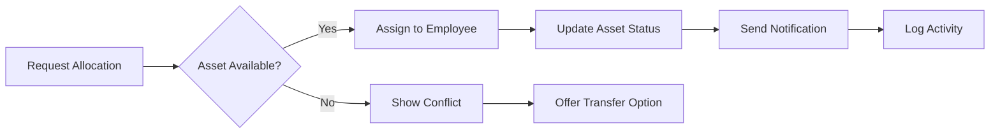
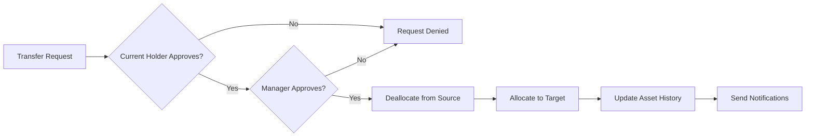
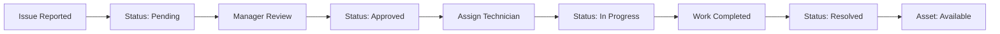
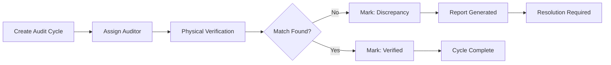
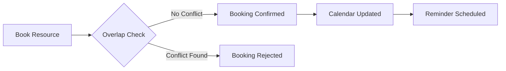

<a id="top"></a>

<div align="center">

<br />


<br />
<br />

# Enterprise Asset Intelligence Platform

**Track assets. Automate maintenance. Optimize allocations. Audit compliance.**

*From registration to retirement — one platform that transforms asset management from manual tracking into operational intelligence.*

<br />


<br />

[**Live Platform**](https://assetrix-nu.vercel.app) · [**API Documentation**](https://assetrix-backend-production-9a94.up.railway.app/api-docs) · [**GitHub**](https://github.com/Shubham-997800/assetrix)

</div>

<br />

---

<br />

## Quick Start

### Prerequisites
- Node.js 18+
- PostgreSQL 16+
- Redis 7+

### Development Setup

```bash
# Clone the repository
git clone https://github.com/Shubham-997800/assetrix.git
cd assetrix

# Install frontend dependencies
npm install

# Install backend dependencies
cd backend && npm install && cd ..

# Set up environment variables
cp backend/.env.example backend/.env
# Edit backend/.env with your database credentials

# Push database schema
cd backend
npx prisma db push

# Seed test data (optional)
npx tsx prisma/seed.ts

# Start backend server (port 5000)
npm run dev

# In a new terminal — start frontend (port 3000)
cd ..
npm run dev
```

### Test Credentials (after seeding)

| Role | Email | Password | Access Level |
|:-----|:------|:---------|:-------------|
| **Admin** | rahul@assetrix.com | admin123 | Full system access |
| **Asset Manager** | priya@assetrix.com | manager123 | Asset & allocation management |
| **Department Head** | amit@assetrix.com | head123 | Department-level access |
| **Employee** | neha@assetrix.com | emp123 | Personal assets & bookings |
| **Employee** | arjun@assetrix.com | emp123 | Personal assets & bookings |
| **Auditor** | kavya@assetrix.com | auditor123 | Audit & compliance verification |

<br />

---

<br />

## Live Deployment

<div align="center">

| Service | URL | Stack | Status |
|:--------|:----|:------|:-------|
| **Frontend** | [assetrix-nu.vercel.app](https://assetrix-nu.vercel.app) | Next.js 16 + React 19 | ✅ Active |
| **Backend API** | [assetrix-backend-production-9a94.up.railway.app](https://assetrix-backend-production-9a94.up.railway.app) | Express.js + Prisma | ✅ Active |
| **API Docs** | [/api-docs](https://assetrix-backend-production-9a94.up.railway.app/api-docs) | Swagger/OpenAPI | ✅ Active |
| **Database** | PostgreSQL (Railway Managed) | Prisma ORM v6 | ✅ Connected |
| **Cache** | Redis (Railway Managed) | BullMQ Queues | ✅ Connected |
| **Source** | [github.com/Shubham-997800/assetrix](https://github.com/Shubham-997800/assetrix) | Git + Vercel CI/CD | ✅ Public |

</div>

<br />

---

<br />

## What This Platform Does

<div align="center">

```
  REGISTRATION    ALLOCATION    TRANSFER     MAINTENANCE    AUDIT      ANALYTICS
  ──────────── → ─────────── → ────────── → ──────────── → ──────── → ──────────
  Capture          Assign         Approve        Schedule       Verify     Measure
  Lifecycle        Conflicts      Workflows      Preventive     Discrepan  Intelligence
  Ownership        Real-time      Multi-level    Automated      Compliance Operational
```

</div>

Assetrix is a full-stack enterprise ERP platform built for organizations that manage physical assets at scale — hospitals tracking medical equipment, universities managing lab instruments, enterprises governing IT infrastructure, and manufacturers monitoring production tools.

The platform replaces spreadsheets, email chains, and fragmented tools with a **unified operational system** that provides real-time visibility into every asset's lifecycle.

<br />

---

<br />

## Why This Exists

<div align="center">

| The Problem | The Reality | The Impact |
|:-----------:|:-----------:|:----------:|
| Spreadsheet Tracking | 73% of enterprises still use Excel for asset management | $4.2M annual loss from asset mismanagement |
| Email-based Approvals | Average 3.2 days to process allocation requests | 40% productivity loss during waiting periods |
| Reactive Maintenance | Unplanned downtime costs 10x more than planned | 60% of equipment failures are preventable |
| Manual Audit Cycles | Audit preparation takes 2-4 weeks per cycle | 85% auditor time spent on data gathering |

</div>

Assetrix exists because **asset management should not be an operational bottleneck.** Organizations need centralized visibility, automated workflows, and intelligent decision support — not another spreadsheet.

<br />

---

<br />

## Problem Statement

Organizations managing physical assets face compounding operational challenges:

**Asset Visibility Gap**
No single source of truth for asset location, condition, allocation status, or ownership history. Information scattered across spreadsheets, emails, and tribal knowledge.

**Allocation Conflicts**
Multiple departments request the same asset simultaneously. No real-time availability checking. No conflict detection. Manual resolution through email chains.

**Booking Collisions**
Shared resources (meeting rooms, vehicles, equipment) get double-booked. Calendar conflicts discovered only at the time of use. No automated overlap prevention.

**Maintenance Chaos**
Preventive maintenance schedules tracked in separate systems. Overdue tasks go unnoticed until equipment fails. No escalation workflows. No cost tracking.

**Audit Friction**
Audit preparation requires weeks of manual data gathering. Discrepancies found after the fact. No real-time verification. Compliance gaps discovered too late.

**Reporting Black Hole**
No operational dashboards. No utilization metrics. No maintenance trend analysis. Decisions made on gut feeling rather than data.

<br />

---

<br />

## Solution Overview

Assetrix centralizes every stage of the asset lifecycle into a unified operational platform:

```
┌─────────────────────────────────────────────────────────────────────────┐
│                                                                         │
│   DEPARTMENTS ──→ EMPLOYEES ──→ ASSETS ──→ ALLOCATION ──→ MAINTENANCE  │
│                                                                         │
│   ┌──────────┐  ┌──────────┐  ┌──────────┐  ┌──────────┐  ┌──────────┐│
│   │ Register │  │ Assign   │  │ Track    │  │ Transfer │  │ Schedule ││
│   │ Hierarchy│  │ Roles    │  │ Lifecycle│  │ Approve  │  │ Prevent  ││
│   │ Structure│  │ Teams    │  │ Monitor  │  │ Reassign │  │ Resolve  ││
│   └──────────┘  └──────────┘  └──────────┘  └──────────┘  └──────────┘│
│                                                                         │
│                    ──→ AUDIT ──→ ANALYTICS ──→ INTELLIGENCE             │
│                                                                         │
│                    ┌──────────┐  ┌──────────┐  ┌──────────┐            │
│                    │ Verify   │  │ Measure  │  │ Predict  │            │
│                    │ Discrepan│  │ Utilize  │  │ Optimize │            │
│                    │ Comply   │  │ Report   │  │ Decide   │            │
│                    └──────────┘  └──────────┘  └──────────┘            │
│                                                                         │
└─────────────────────────────────────────────────────────────────────────┘
```

<br />

---

<br />

## Core Modules

<div align="center">

### Dashboard

*Real-time operational command center*

- 6 KPI cards with live counters (Assets, Bookings, Maintenance, Audit Score)
- Asset utilization bar charts with 12-month trends
- Maintenance queue with priority indicators
- Recent activity timeline with status tracking
- Upcoming returns and conflict alerts

---

### Organization Setup

*Department hierarchy and team structure*

- Create and manage departments with parent-child relationships
- Assign department heads with role-based permissions
- Organize assets by department, category, and location
- Employee directory with role assignments and reporting structure

---

### Asset Directory

*Complete asset lifecycle management*

- Register assets with purchase details, warranty, and location
- Generate unique asset tags and QR codes automatically
- Upload documents (invoices, warranties, manuals)
- Track condition, depreciation, and current value
- Search and filter across 15+ attributes

---

### Allocation & Transfer

*Conflict-free asset assignment*

- Allocate assets to employees with real-time availability checks
- Automatic conflict detection prevents duplicate allocations
- Multi-level approval workflow for transfers
- Complete allocation history with timestamp audit trail

---

### Resource Booking

*Shared resource scheduling with overlap prevention*

- Book shared resources (rooms, vehicles, equipment) with time slots
- Automatic overlap validation blocks conflicting bookings
- Calendar view for visual scheduling
- Approval workflow for booking requests

---

### Maintenance Operations

*Preventive and reactive maintenance management*

- Raise maintenance requests with priority levels
- Automated assignment to available technicians
- Status workflow: Pending → Approved → Assigned → In Progress → Resolved
- Cost tracking and maintenance history per asset
- Scheduled maintenance with recurrence patterns

---

### Audit Management

*Compliance verification and discrepancy tracking*

- Create audit cycles with defined scope and timeline
- Assign auditors to specific asset groups
- Physical verification with status recording
- Discrepancy reports for damaged, missing, or misallocated assets
- Audit closure with compliance scoring

---

### Reports & Analytics

*Operational intelligence and exportable insights*

- Asset utilization reports with department breakdown
- Maintenance trend analysis and cost tracking
- Booking heatmap and resource optimization
- Idle asset detection and retirement forecasting
- Export to CSV, PDF, and Excel formats

---

### Notifications

*Real-time operational alerts*

- Asset allocation and transfer notifications
- Booking approval and conflict alerts
- Maintenance status updates and escalations
- Audit discrepancy notifications
- Overdue return reminders
- Customizable notification preferences per channel

---

### AI Operational Intelligence

*Data-driven decision support*

- Idle asset detection with reallocation recommendations
- Maintenance failure prediction with confidence scoring
- Utilization optimization suggestions
- Resource allocation intelligence
- Operational anomaly alerts

</div>

<br />

---

<br />

## Asset Lifecycle

<div align="center">

```
                    ┌──────────────┐
         ┌─────────│   REGISTERED  │─────────┐
         │         └──────────────┘         │
         ▼                                   ▼
  ┌─────────────┐                   ┌──────────────┐
  │  AVAILABLE  │◄─────────────────│   RESERVED   │
  └──────┬──────┘    Booking End    └──────────────┘
         │ Cancel / Release
         │
         │ Allocate
         ▼
  ┌─────────────┐    Transfer     ┌──────────────┐
  │  ALLOCATED  │───────────────►│   TRANSFER   │
  └──────┬──────┘   Request       └──────┬───────┘
         │                               │ Approved
         │ Issue Reported                ▼
         │                         ┌──────────────┐
         ▼                         │  REALLOCATED  │
  ┌─────────────┐                  └──────────────┘
  │ MAINTENANCE │
  └──────┬──────┘
         │ Resolved
         ▼
  ┌─────────────┐
  │  AVAILABLE  │──────► Ready for next allocation
  └─────────────┘

         ┌─────────────┐    ┌─────────────┐    ┌─────────────┐
         │    LOST     │    │   RETIRED   │    │  DISPOSED   │
         └─────────────┘    └─────────────┘    └─────────────┘
              Flagged          End of Life        Disposal
```

</div>

<br />

---

<br />

## Workflow Visualizations

### Asset Allocation



### Transfer Workflow



### Maintenance Workflow



### Audit Workflow



### Booking Workflow



<br />

---

<br />

## API Endpoints Reference

<div align="center">

### Authentication
| Method | Endpoint | Description |
|:-------|:---------|:------------|
| POST | `/api/auth/register` | Register new user |
| POST | `/api/auth/login` | Login (returns JWT) |
| POST | `/api/auth/refresh` | Refresh access token |
| POST | `/api/auth/forgot-password` | Request password reset |
| POST | `/api/auth/reset-password` | Reset password with token |
| POST | `/api/auth/verify-email` | Verify email address |
| GET | `/api/auth/me` | Get current user profile |

### Organization
| Method | Endpoint | Description |
|:-------|:---------|:------------|
| GET/POST | `/api/departments` | List / Create departments |
| GET/PUT/DELETE | `/api/departments/:id` | Department CRUD |
| GET/POST | `/api/categories` | List / Create asset categories |
| GET/PUT/DELETE | `/api/categories/:id` | Category CRUD |
| GET/POST | `/api/employees` | List / Create employees |
| GET/PUT/DELETE | `/api/employees/:id` | Employee CRUD |

### Assets
| Method | Endpoint | Description |
|:-------|:---------|:------------|
| GET/POST | `/api/assets` | List / Create assets |
| GET/PUT/DELETE | `/api/assets/:id` | Asset CRUD |
| GET | `/api/assets/:id/history` | Asset history timeline |
| GET | `/api/assets/stats` | Asset statistics |

### Allocations
| Method | Endpoint | Description |
|:-------|:---------|:------------|
| GET/POST | `/api/allocations` | List / Create allocations |
| PUT | `/api/allocations/:id/approve` | Approve allocation |
| PUT | `/api/allocations/:id/release` | Release allocation |
| GET | `/api/allocations/:id` | Allocation details |

### Transfers
| Method | Endpoint | Description |
|:-------|:---------|:------------|
| GET/POST | `/api/transfers` | List / Request transfer |
| PUT | `/api/transfers/:id/approve` | Approve transfer |
| PUT | `/api/transfers/:id/reject` | Reject transfer |

### Bookings
| Method | Endpoint | Description |
|:-------|:---------|:------------|
| GET/POST | `/api/bookings` | List / Create bookings |
| PUT | `/api/bookings/:id/approve` | Approve booking |
| PUT | `/api/bookings/:id/cancel` | Cancel booking |
| GET | `/api/bookings/availability` | Check resource availability |

### Maintenance
| Method | Endpoint | Description |
|:-------|:---------|:------------|
| GET/POST | `/api/maintenance` | List / Create requests |
| PUT | `/api/maintenance/:id/status` | Update maintenance status |
| PUT | `/api/maintenance/:id/assign` | Assign technician |
| GET | `/api/maintenance/schedule` | Maintenance schedule |

### Audit
| Method | Endpoint | Description |
|:-------|:---------|:------------|
| GET/POST | `/api/audits` | List / Create audit cycles |
| GET/PUT | `/api/audits/:id` | Audit details / Update |
| POST | `/api/audits/:id/verify` | Verify asset in audit |
| GET | `/api/audits/:id/discrepancies` | List discrepancies |

### Reports
| Method | Endpoint | Description |
|:-------|:---------|:------------|
| GET | `/api/reports/utilization` | Utilization report |
| GET | `/api/reports/maintenance` | Maintenance trends |
| GET | `/api/reports/allocation` | Allocation history |
| GET | `/api/reports/export/csv` | Export to CSV |
| GET | `/api/reports/export/pdf` | Export to PDF |
| GET | `/api/reports/export/excel` | Export to Excel |

### Notifications
| Method | Endpoint | Description |
|:-------|:---------|:------------|
| GET | `/api/notifications` | List notifications |
| PUT | `/api/notifications/:id/read` | Mark as read |
| PUT | `/api/notifications/read-all` | Mark all as read |
| GET/PUT | `/api/notifications/preferences` | Notification settings |

### AI Intelligence
| Method | Endpoint | Description |
|:-------|:---------|:------------|
| GET | `/api/ai/recommendations` | Idle asset recommendations |
| GET | `/api/ai/predictions` | Maintenance predictions |
| GET | `/api/ai/insights` | Utilization insights |
| GET | `/api/ai/alerts` | Operational anomaly alerts |

</div>

<br />

---

<br />

## Enterprise Features

<div align="center">

| Feature | Description |
|:--------|:------------|
| **Role-Based Access Control** | Admin, Asset Manager, Department Head, Employee — each role with distinct permissions |
| **Approval Workflows** | Multi-level approval for allocations, transfers, and maintenance requests |
| **Audit Trail** | Complete activity logging with timestamps, user attribution, and IP tracking |
| **Notification System** | Multi-channel alerts (in-app, email) with customizable preferences |
| **Global Search** | `Ctrl+K` command palette with fuzzy search across all modules |
| **Keyboard Shortcuts** | Full keyboard navigation with discoverable shortcut reference |
| **Data Export** | CSV, PDF, and Excel export for all reports and data tables |
| **Dark/Light Mode** | System-aware theme with manual override and persistence |
| **Responsive Design** | Optimized for mobile, tablet, laptop, desktop, and ultra-wide displays |
| **Accessibility** | WCAG 2.1 AA compliant with screen reader support and focus management |
| **Performance Optimized** | GPU-composited animations, memoized contexts, lazy-loaded sections |
| **Security Hardened** | Helmet.js, CSP headers, rate limiting, CORS, input validation |

</div>

<br />

---

<br />

## User Roles & Permissions

<div align="center">

| Module | Admin | Asset Manager | Department Head | Employee |
|:-------|:-----:|:-------------:|:---------------:|:--------:|
| **Dashboard** | Full | Full | Department | Personal |
| **Organization** | CRUD | Read | Read (Dept) | - |
| **Assets** | Full | Full | Department | Read Only |
| **Allocation** | Full | Full | Approve | Request |
| **Transfer** | Approve All | Request | Approve Dept | Request |
| **Booking** | Full | Full | Department | Personal |
| **Maintenance** | Full | Assign | Approve | Request |
| **Audit** | Full | Verify | Department | Read Only |
| **Reports** | Full | Full | Department | Personal |
| **Notifications** | Full | Full | Full | Personal |
| **Settings** | System | Profile | Profile | Profile |
| **Admin Panel** | Full | - | - | - |
| **AI Insights** | Full | Full | Department | Personal |

</div>

<br />

---

<br />

## AI Operational Intelligence

Assetrix includes a built-in intelligence layer that analyzes operational data and generates actionable recommendations.

<div align="center">

```
┌──────────────┐     ┌──────────────┐     ┌──────────────┐     ┌──────────────┐
│  Asset Data  │ ──► │  AI Engine   │ ──► │  Prediction  │ ──► │  Decision    │
│  Collection  │     │  Analysis    │     │  Generation  │     │  Support     │
└──────────────┘     └──────────────┘     └──────────────┘     └──────────────┘
                                                                      │
                                           ┌──────────────────────────┘
                                           ▼
                                    ┌──────────────┐
                                    │ Recommendation│
                                    │ • Idle Assets │
                                    │ • Maintenance │
                                    │ • Utilization │
                                    │ • Cost Optim. │
                                    └──────────────┘
```

</div>

**Intelligence Categories:**

| Category | Capability |
|:---------|:-----------|
| **Idle Asset Detection** | Identifies assets with zero utilization over configurable timeframes |
| **Maintenance Prediction** | Forecasts maintenance needs based on historical patterns and asset age |
| **Utilization Insights** | Highlights over-utilized and under-utilized assets per department |
| **Resource Optimization** | Recommends reallocation paths to maximize asset utilization |
| **Cost Analysis** | Tracks maintenance costs and identifies cost-saving opportunities |
| **Compliance Alerts** | Flags overdue audits and upcoming warranty expirations |

<br />

---

<br />

## Architecture

<div align="center">

```
┌─────────────────────────────────────────────────────────────────────┐
│                          CLIENT LAYER                                │
│  ┌─────────────┐  ┌─────────────┐  ┌─────────────┐                 │
│  │  Next.js 16  │  │  React 19   │  │  Tailwind 4  │                │
│  │  App Router  │  │  Components │  │  Aura Cyan   │                │
│  └─────────────┘  └─────────────┘  └─────────────┘                 │
├─────────────────────────────────────────────────────────────────────┤
│                         API LAYER                                    │
│  ┌─────────────┐  ┌─────────────┐  ┌─────────────┐                 │
│  │  Express.js  │  │  Prisma ORM │  │  BullMQ     │                 │
│  │  REST APIs   │  │  Type-safe  │  │  Job Queues │                 │
│  └─────────────┘  └─────────────┘  └─────────────┘                 │
├─────────────────────────────────────────────────────────────────────┤
│                        DATA LAYER                                    │
│  ┌─────────────┐  ┌─────────────┐  ┌─────────────┐                 │
│  │  PostgreSQL  │  │   Redis     │  │  File Store │                 │
│  │  Primary DB  │  │   Cache +   │  │  Documents  │                 │
│  │              │  │   Sessions  │  │  & Exports  │                 │
│  └─────────────┘  └─────────────┘  └─────────────┘                 │
├─────────────────────────────────────────────────────────────────────┤
│                       INFRASTRUCTURE                                 │
│  ┌─────────────┐  ┌─────────────┐  ┌─────────────┐                 │
│  │   Vercel     │  │  Railway    │  │  GitHub     │                 │
│  │  Frontend    │  │  Backend +  │  │  Source +   │                 │
│  │  Hosting     │  │  Databases  │  │  CI/CD      │                 │
│  └─────────────┘  └─────────────┘  └─────────────┘                 │
└─────────────────────────────────────────────────────────────────────┘
```

</div>

<br />

---

<br />

## Technology Stack

<div align="center">

### Frontend

| Technology | Purpose |
|:-----------|:--------|
| Next.js 16 | React framework with App Router, Server Components, Turbopack |
| React 19 | UI library with concurrent features |
| TypeScript 5 | Full type safety across every module |
| Tailwind CSS v4 | Utility-first styling with Aura Cyan design tokens |
| shadcn/ui | Accessible, composable component primitives (base-nova style) |
| Lucide React | Consistent icon system |
| next-themes | Dark/Light/System mode with persistence |

### Backend

| Technology | Purpose |
|:-----------|:--------|
| Express.js | REST API framework with middleware architecture |
| Prisma ORM v6 | Type-safe database access with schema-first design |
| BullMQ | Background job processing (email, reports, analytics) |
| JSON Web Tokens | Stateless authentication with refresh token rotation |
| bcrypt | Password hashing with salt rounds |
| Zod | Request validation and schema enforcement |
| Helmet | Security headers and HTTP hardening |
| Swagger/OpenAPI | Auto-generated API documentation |
| Nodemailer | Email delivery (transactional + notifications) |
| ExcelJS | Excel export for reports |
| PDFKit | PDF generation for reports |

### Data & Infrastructure

| Technology | Purpose |
|:-----------|:--------|
| PostgreSQL 16 | Primary relational database (30+ models) |
| Redis 7 | Session management, caching, rate limiting, job queues |
| Railway | Backend hosting with managed PostgreSQL + Redis |
| Vercel | Frontend hosting with edge network |
| GitHub | Source control and CI/CD pipeline |
| Docker | Multi-stage production builds for backend |

</div>

<br />

---

<br />

## Security

<div align="center">

| Layer | Implementation |
|:------|:---------------|
| **Authentication** | JWT access tokens (15min) + refresh token rotation (7d) |
| **Authorization** | Role-based access control with permission isolation |
| **Password Security** | bcrypt hashing with configurable salt rounds |
| **Session Management** | Redis-backed sessions with device tracking and revocation |
| **Input Validation** | Zod schema validation on all API endpoints |
| **Security Headers** | Helmet.js with CSP, HSTS, X-Frame-Options |
| **Rate Limiting** | Express rate limiter with configurable windows |
| **Audit Logging** | Complete activity trail with timestamps and attribution |
| **CORS** | Origin-restricted with credential support |
| **Data Encryption** | TLS in transit, encrypted secrets in environment |

</div>

<br />

---

<br />

## Accessibility

<div align="center">

| Standard | Status |
|:---------|:-------|
| **Keyboard Navigation** | Full support across all interactive elements |
| **Screen Reader Support** | ARIA labels, landmarks, live regions |
| **Color Contrast** | WCAG 2.1 AA compliant |
| **Focus Management** | Visible focus rings, focus traps in modals |
| **Touch Targets** | Minimum 44px on all interactive elements |
| **Reduced Motion** | Respects `prefers-reduced-motion` |
| **Semantic HTML** | `<main>`, `<nav>`, `<header>`, `<footer>`, `<aside>` |
| **Skip Navigation** | Skip-to-content link in dashboard |
| **Error Communication** | `role="alert"` with descriptive messages |
| **Form Accessibility** | Associated labels, error descriptions, required indicators |

</div>

<br />

---

<br />

## Responsive Design

<div align="center">

| Breakpoint | Range | Adaptations |
|:-----------|:------|:------------|
| **Mobile** | < 640px | Single column, stacked navigation, full-width cards, bottom safe areas |
| **Tablet** | 640px - 1024px | Two-column grids, collapsible sidebar, adapted charts |
| **Laptop** | 1024px - 1280px | Full sidebar, multi-column layouts, inline filters |
| **Desktop** | 1280px - 1536px | Complete dashboard experience, side panels |
| **Ultra-wide** | > 1536px | Centered content with max-width, extended data tables |

</div>

<br />

---

<br />

## Performance Optimizations

<div align="center">

| Optimization | Implementation |
|:-------------|:---------------|
| **GPU-Composited Animations** | CSS transforms instead of width/height layout-triggering animations |
| **Memoized Context** | Dashboard provider value wrapped in `useMemo` — prevents unnecessary re-renders |
| **Static Bundle Caching** | `_next/static` assets served with 1-year immutable cache headers |
| **Compression** | Gzip/Brotli enabled via Next.js middleware |
| **Image Optimization** | AVIF/WebP format auto-negotiation with 30-day cache |
| **Component Memoization** | Heavy components use `React.memo`, `useMemo`, `useCallback` |
| **Code Splitting** | Dynamic imports for below-fold landing sections |
| **Security Headers** | No performance overhead — standard HTTP headers only |
| **Tree Shaking** | `optimizePackageImports` for lucide-react and @base-ui/react |
| **Turbopack** | Native bundler for instant HMR in development |

</div>

<br />

---

<br />

## Project Structure

```
assetrix/
├── src/
│   ├── app/                          # Next.js App Router
│   │   ├── page.tsx                  # Landing Page (16 sections)
│   │   ├── login/                    # Authentication pages
│   │   ├── register/
│   │   ├── forgot-password/
│   │   ├── reset-password/
│   │   ├── verify-email/
│   │   └── dashboard/                # Enterprise dashboard
│   │       ├── page.tsx              # KPIs, Charts, Activity
│   │       ├── assets/               # Asset management
│   │       ├── allocations/          # Allocation engine
│   │       ├── bookings/             # Resource booking
│   │       ├── maintenance/          # Maintenance workflows
│   │       ├── audit/                # Audit cycles
│   │       ├── reports/              # Analytics & reports
│   │       ├── notifications/        # Notification center
│   │       ├── organization/         # Department structure
│   │       ├── settings/             # System preferences
│   │       └── profile/              # User profile
│   │
│   ├── components/
│   │   ├── ui/                       # shadcn/ui primitives
│   │   ├── auth/                     # Authentication components
│   │   ├── dashboard/                # Dashboard shell & navigation
│   │   ├── landing/                  # 16 landing page sections
│   │   └── shared/                   # Shared utilities
│   │
│   ├── contexts/                     # React contexts (memoized)
│   ├── hooks/                        # Custom React hooks
│   └── lib/                          # Utility functions
│
├── backend/
│   ├── src/
│   │   ├── controllers/              # Route handlers
│   │   ├── services/                 # Business logic
│   │   ├── middleware/               # Auth, validation, errors
│   │   ├── routes/                   # API route definitions
│   │   ├── queues/                   # Background job workers
│   │   ├── notifications/            # Notification engine
│   │   ├── audit/                    # Audit trail system
│   │   ├── utils/                    # Export, helpers
│   │   └── config/                   # Environment, database, Redis
│   │
│   ├── prisma/
│   │   ├── schema.prisma             # Database schema (30+ models)
│   │   └── seed.ts                   # Test data seeder
│   │
│   └── Dockerfile                    # Multi-stage production build
│
├── railway.json                      # Railway deployment config
├── next.config.ts                    # Next.js config (optimized)
├── tsconfig.json                     # TypeScript config
├── eslint.config.mjs                 # ESLint config
└── README.md
```

<br />

---

<br />

## Database Schema

<div align="center">

```
┌──────────────────────────────────────────────────────────────┐
│                     PRISMA SCHEMA (30+ MODELS)                │
├──────────────────────────────────────────────────────────────┤
│                                                              │
│  AUTH & USERS              ORGANIZATION                      │
│  ├── User                  ├── Organization                  │
│  ├── Role                  ├── Department                    │
│  └── Session               ├── Category                      │
│                            └── Location                      │
│  ASSETS                                                    │
│  ├── Asset                 BOOKINGS                          │
│  ├── AssetDocument         ├── Booking                       │
│  └── AssetHistory          └── BookingResource                │
│                                                              │
│  ALLOCATIONS             MAINTENANCE                         │
│  ├── Allocation           ├── MaintenanceRequest             │
│  └── TransferRequest      ├── MaintenanceSchedule            │
│                            └── MaintenanceCost                │
│  AUDIT                 NOTIFICATIONS                         │
│  ├── AuditCycle           ├── Notification                   │
│  ├── AuditAssignment      ├── NotificationPreference         │
│  ├── AuditVerification    └── NotificationTemplate            │
│  └── AuditDiscrepancy                                       │
│                                                              │
│  REPORTS & AI           SYSTEM                               │
│  ├── Report               ├── AuditLog                       │
│  ├── AIRecommendation     ├── ActivityLog                    │
│  ├── TaskPrediction       └── SystemConfig                   │
│  └── UtilizationMetric                                     │
│                                                              │
└──────────────────────────────────────────────────────────────┘
```

</div>

<br />

---

<br />

## Platform Metrics

<div align="center">

| Metric | Value |
|:-------|:------|
| **Frontend Routes** | 23 pages across auth, dashboard, and operations |
| **Backend APIs** | 16 route modules with 100+ endpoints |
| **Database Models** | 30+ Prisma models with full relations |
| **UI Components** | 40+ custom components with accessibility |
| **Design Tokens** | Aura Cyan system with dark/light themes |
| **Build Size** | Optimized with Turbopack and tree-shaking |
| **API Documentation** | Swagger/OpenAPI auto-generated |
| **Background Jobs** | Email, reports, analytics via BullMQ |
| **Export Formats** | CSV, PDF, Excel |
| **Security Headers** | 6 custom headers + Helmet.js |

</div>

<br />

---

<br />

## Deployment Guide

### Frontend (Vercel)
```bash
# Automatic deployment via GitHub integration
git push origin main

# Manual deployment
npx vercel --prod --yes
```

### Backend (Railway)
```bash
# Automatic deployment via GitHub integration
git push origin main

# Manual deployment
railway up

# Database migration
railway run npx prisma db push

# Seed test data
railway run npx tsx prisma/seed.ts
```

### Environment Variables

**Frontend (.env.local)**
```env
NEXT_PUBLIC_API_URL=https://assetrix-backend-production-9a94.up.railway.app
```

**Backend (.env)**
```env
PORT=5000
NODE_ENV=production
DATABASE_URL=postgresql://...
REDIS_URL=redis://...
JWT_SECRET=your-secret-key
JWT_REFRESH_SECRET=your-refresh-secret
EMAIL_HOST=smtp.example.com
EMAIL_PORT=587
EMAIL_USER=your-email
EMAIL_PASS=your-password
```

<br />

---

<br />

## Design Principles

<div align="center">

```
Structure       over      Decoration
Consistency     over      Creativity
Clarity         over      Complexity
Professionalism over      Personality
Engineering     over      Marketing

Single brand color: Aura Cyan (#0891B2 / #22D3EE)
80% neutral colors + 20% accent colors
No gradients, no neon, no glassmorphism
Professional enterprise typography
All currency in Indian Rupees (₹)
```

</div>

<br />

---

<br />

## Development Workflow

```bash
# Start development
npm run dev          # Frontend (port 3000)
cd backend && npm run dev  # Backend (port 5000)

# Lint
npm run lint         # Frontend (0 errors expected)

# Build
npm run build        # Production build

# Database
cd backend
npx prisma studio    # Visual database browser
npx prisma db push   # Sync schema changes
npx prisma generate  # Regenerate Prisma client
npx tsx prisma/seed.ts  # Seed test data
```

<br />

---

<br />

## Contributing

1. Fork the repository
2. Create a feature branch (`git checkout -b feature/amazing-feature`)
3. Commit changes (`git commit -m 'Add amazing feature'`)
4. Push to branch (`git push origin feature/amazing-feature`)
5. Open a Pull Request

<br />

---

<br />

## License

This project is licensed under the MIT License — see the [LICENSE](LICENSE) file for details.

<br />

---

<br />

<div align="center">

**Assetrix transforms asset management from manual tracking into operational intelligence.**

*The platform enables organizations to move from spreadsheets and fragmented workflows*
*to centralized visibility, automation, accountability, and intelligent decision-making.*

<br />


**[Back to Top](#top)**

</div>
