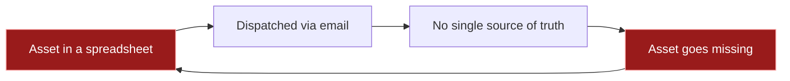
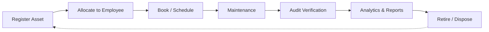
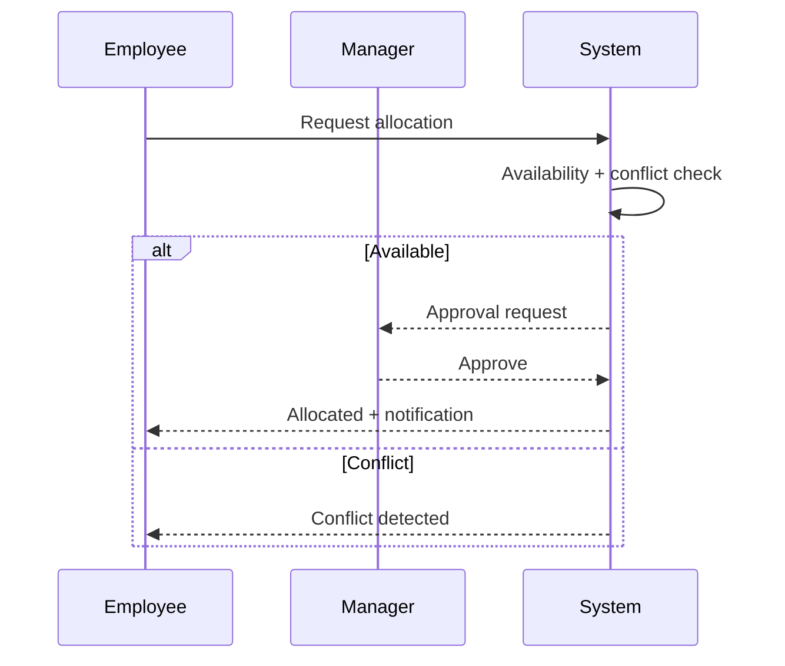
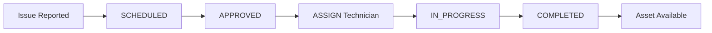
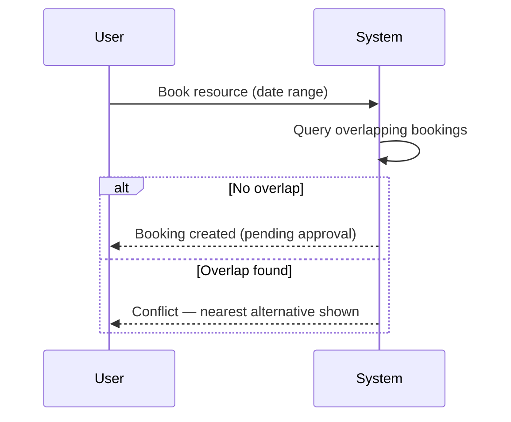
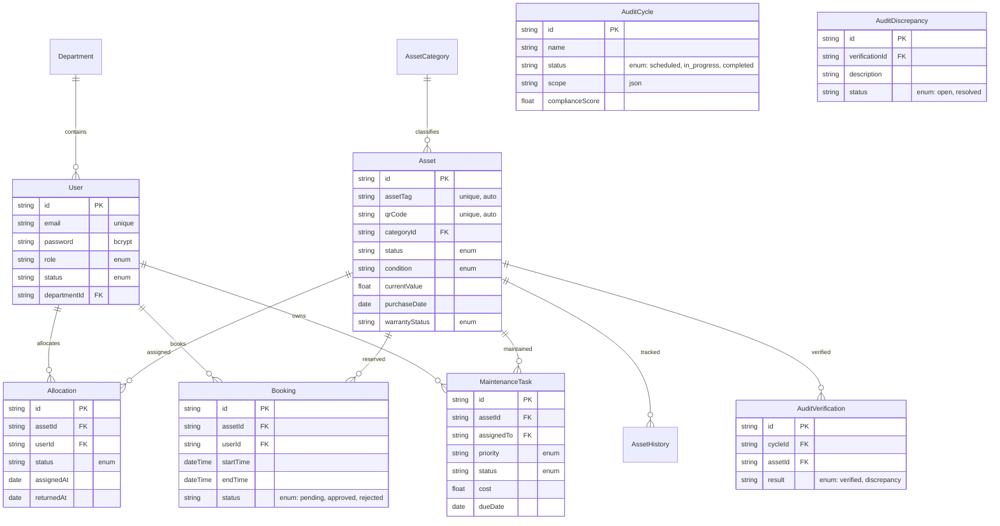

<a id="top"></a>

<p align="center">
  <picture>
    <source media="(prefers-color-scheme: dark)" srcset="https://readme-typing-svg.herokuapp.com?font=Fira+Code&weight=700&size=32&duration=3200&pause=600&color=22D3EE&center=true&vCenter=true&width=620&height=80&lines=Assetrix;Enterprise+Asset+%26+Resource+Mgmt;Track+Assets+%E2%80%A2+Automate+Maintenance;Audit+Compliance+%E2%80%A2+Operational+Intelligence">
    
  </picture>
</p>

<p align="center">
  <b>An Enterprise Asset & Resource Management Platform</b><br>
  <i>From registration to retirement — turn manual asset tracking into operational intelligence.</i>
</p>

<p align="center">
  <a href="https://assetrix-nu.vercel.app"></a>
  <a href="https://github.com/Shubham-997800/assetrix"></a>
  <a href="https://github.com/Shubham-997800/assetrix/stargazers"></a>
  <a href="https://opensource.org/licenses/MIT"></a>
</p>

<p align="center">
  
  
  
  
  
  
  
  
  
  
  
  
  
  
  
</p>

<p align="center">
  <a href="https://github.com/Shubham-997800/assetrix/releases"></a>
  <a href="https://github.com/Shubham-997800/assetrix/releases"></a>
  <a href="https://github.com/Shubham-997800/assetrix/releases"></a>
</p>

<br>

---

## 📦 Table of Contents

- [Problem Statement](#-problem-statement)
- [Why Assetrix?](#-why-assetrix)
- [Key Features](#-key-features)
- [Screens & Modules](#-screens--modules)
- [UI Libraries & Design System](#-ui-libraries--design-system)
- [Tech Stack](#-tech-stack)
- [System Architecture](#-system-architecture)
- [Project Workflow](#-project-workflow)
- [Folder Structure](#-folder-structure)
- [Database Schema](#-database-schema)
- [API Architecture](#-api-architecture)
- [AI / Intelligence Layer](#-ai--intelligence-layer)
- [Request Lifecycle](#-request-lifecycle)
- [Getting Started](#-getting-started)
- [Deployment](#-deployment)
- [Recent Improvements](#-recent-improvements)
- [Roadmap](#-roadmap)
- [License & Usage](#-license--usage)
- [Author](#-author)
- [Acknowledgements](#-acknowledgements)

---

## 🧠 Problem Statement

### The Asset Management Paradox

Organizations still manage physical assets the way they did two decades ago. **Spreadsheets, email chains, and fragmented tools** scatter asset data across departments — nobody has a single source of truth.

```
Current reality:   Spreadsheets → Emails → Approvals → Manual Audits → Fragmented
What we need:      Register  → Allocate → Maintain  → Audit       → Intelligent
```

### Why Manual Tracking Fails


```mermaid
graph LR
    A[Asset in a spreadsheet] --> B[Dispatched via email]
    B --> C[No single source of truth]
    C --> D[Asset goes missing]
    D --> A
    style A fill:#991b1b,stroke:#fca5a5,color:#fff
    style D fill:#991b1b,stroke:#fca5a5,color:#fff
```

| The Problem | The Reality | The Impact |
|:-----------:|:-----------:|:----------:|
| Spreadsheet Tracking | Many enterprises still use Excel for asset management | Significant annual loss from asset mismanagement |
| Email-based Approvals | Average 3+ days to process allocation requests | Productivity loss during waiting periods |
| Reactive Maintenance | Unplanned downtime costs far more than planned | Most equipment failures are preventable |
| Manual Audit Cycles | Audit preparation takes 2–4 weeks per cycle | Auditor time spent on data gathering |

### How Assetrix Solves This

Assetrix replaces fragmented workflows with a **unified operational system** — one platform covering the full lifecycle, with automated approvals, conflict-free scheduling, and compliance-ready audit trails.

```
Assetrix:  Register → Allocate → Transfer → Maintain → Audit → Analytics
```

> [!NOTE]
> Assetrix is not just an asset register. It is an **operational backbone** — RBAC, approval workflows, real-time availability checks, preventive maintenance, and intelligence-driven recommendations in a single system.

---

## 🚀 Why Assetrix?

### The Vision

We believe asset management should never be an **operational bottleneck**. Assetrix was built on three core principles:

| Principle | What It Means |
|-----------|---------------|
| **Lifecycle-First** | Every module maps to a real stage of the asset lifecycle — registration, allocation, transfer, maintenance, audit, retirement. |
| **Automation > Forms** | Approvals, availability checks, technician assignment, and report generation run automatically, not through manual follow-ups. |
| **Accountability by Design** | Every action is logged. Every allocation has an audit trail. Every role sees only what it should. |

### What Makes It Different

| Feature | Manual / Spreadsheet | Assetrix |
|---------|---------------------|----------|
| Asset Registration | Manual row entry | Auto-generated asset tag + QR code, 15+ attributes |
| Allocation | Email + wait | Real-time availability check + multi-level approval |
| Booking Conflicts | Double-booked rooms/vehicles | Automatic overlap validation + calendar view |
| Maintenance | Reactive, when it breaks | Preventive schedules + automatic technician assignment |
| Audits | 2–4 week manual prep | Scope → assignment → verification → compliance score |
| Reporting | Hand-built exports | CSV / PDF / Excel reports on demand |
| Visibility | "Ask IT" | Real-time dashboard across every department |

---

## ✨ Key Features

### 🖥️ Core Modules

| Feature | Description |
|---------|-------------|
| **📊 Dashboard** | Real-time command center — KPI cards, 12-month utilization trends, maintenance queue, activity timeline, upcoming-return alerts. |
| **🏛️ Organization Setup** | Department hierarchy with parent–child relationships, department heads, and an employee directory with role assignments. |
| **🖥️ Asset Directory** | Register assets with purchase details, warranty, location, condition, depreciation, and current value; auto asset tags + QR codes. |
| **🔁 Allocation & Transfer** | Conflict-free assignment with real-time availability checks, multi-level approval workflows, and a complete allocation history audit trail. |
| **📅 Resource Booking** | Shared-resource scheduling with automatic overlap validation, calendar view, and approval workflows. |
| **🔧 Maintenance Operations** | Preventive + reactive maintenance with priority levels, automatic technician assignment, and a `SCHEDULED → IN_PROGRESS → COMPLETED` workflow with cost tracking. |
| **🛡️ Audit Management** | Audit cycles with defined scope, auditor assignments, physical verification, discrepancy reports, and compliance scoring. |
| **📈 Reports & Analytics** | Utilization reports, maintenance trends, booking heatmaps, idle-asset detection, and CSV/PDF/Excel export. |
| **🔔 Notifications** | Multi-channel alerts (in-app + email) with per-channel preferences and customizable templates. |
| **🧠 AI Operational Intelligence** | Rule-based health scoring, maintenance predictions, idle-asset detection, and resource-optimization recommendations. |

> [!NOTE]
> The **"AI" layer is rule-based/heuristic** — health-score formulas, condition penalty tables, and age-based recommendations. It does not call an external ML model.

### 🔐 Security & Access

| Feature | Details |
|---------|---------|
| **RBAC** | 8 roles — Super Admin, Admin, Department Manager, Asset Manager, Technician, Auditor, Employee, HR Manager |
| **JWT + Refresh Rotation** | 15-min access tokens, 7-day rotating refresh tokens stored in `httpOnly` cookies |
| **Rate Limiting** | Global 100 req / 15 min, auth 10 req / 15 min |
| **Security Headers** | Helmet + CORS allow-list |
| **Input Validation** | Zod schemas on every endpoint |
| **Password Hashing** | bcrypt, 12 salt rounds |
| **Session Management** | Login history, force-logout, revoke sessions |

---

## 📸 Screens & Modules

> 🔗 **Live demo**: [assetrix-nu.vercel.app](https://assetrix-nu.vercel.app)

| Area | Description |
|-------------|-------------|
| 🏠 **Landing** | Animated hero, feature grid, how-it-works, CTA — 9 sections |
| 📊 **Dashboard** | KPI cards, utilization trends, maintenance queue, activity timeline, upcoming returns |
| 🏛️ **Organization** | Department tree, heads, employee directory |
| 🖥️ **Assets** | Directory with filters, search, QR lookup, lifecycle history |
| 🔁 **Allocations** | Active allocations, transfers, pending approvals |
| 📅 **Bookings** | Overlap-validated scheduling, approvals, calendar |
| 🔧 **Maintenance** | Tasks, schedules, technician assignment, stats |
| 🛡️ **Audit** | Cycles, assignments, verification, discrepancies |
| 📈 **Reports** | Report generation + CSV/PDF/Excel download |
| 🔔 **Notifications** | In-app center + preferences |
| ⚙️ **Settings** | Platform-wide configuration |
| 👤 **Profile** | Personal details, password change |
| 🔐 **Auth** | Login, register, forgot/reset password, email verification, session expiry |

---

## 🎨 UI Libraries & Design System

### What the UI is built with

| Library | Version | What It's Used For |
|---------|---------|-------------------|
| [Next.js](https://nextjs.org) | `16.2.10` | App Router, Server Components, Turbopack bundler, Edge Middleware, `/api` rewrites to backend |
| [React](https://react.dev) | `19.2.4` | UI component model (concurrent rendering) |
| [TypeScript](https://www.typescriptlang.org) | `^5` | Strict type safety across all 46 components |
| [Tailwind CSS](https://tailwindcss.com) | `^4` | Utility-first styling with the **Aura Cyan** design-token system |
| [@base-ui/react](https://base-ui.com) | `^1.6.0` | Headless, accessible primitives — Button, Dialog/Sheet, Render, mergeProps |
| [shadcn/ui](https://ui.shadcn.com) | `^4.13.0` (CLI) | Component scaffolding + style conventions (badge, button, input, sheet, table) |
| [class-variance-authority](https://cva.style) | `^0.7.1` | Variant API for `button` / `badge` (`cva` variants) |
| [clsx](https://github.com/lukeed/clsx) | `^2.1.1` | Conditional class joining |
| [tailwind-merge](https://github.com/dcastil/tailwind-merge) | `^3.6.0` | Dedupes conflicting Tailwind classes in the `cn()` helper |
| [Recharts](https://recharts.org) | `^3.9.2` | Dashboard data visualization (utilization trends, charts) |
| [Lucide React](https://lucide.dev) | `^1.24.0` | Icon system (500+ stroke icons) |
| [next-themes](https://github.com/pacocoursey/next-themes) | `^0.4.6` | Dark / Light / System theme provider |
| [tw-animate-css](https://github.com/CosmoDevDev/tw-animate-css) | `^1.4.0` | Tailwind-compatible animation utilities (fade, bounce, pulse) |
| [@tailwindcss/postcss](https://tailwindcss.com) | `^4` | Tailwind v4 PostCSS plugin |

### Reusable UI Components (`src/components/ui`)

| Component | Base | Used For |
|-----------|------|----------|
| `badge.tsx` | Base UI + CVA | Status labels, module tags |
| `button.tsx` | Base UI Button + CVA | Primary / secondary / ghost actions |
| `input.tsx` | Base UI + Tailwind | Form fields |
| `sheet.tsx` | Base UI Dialog | Slide-in panels, mobile nav |
| `table.tsx` | HTML + Tailwind | Data tables across modules |

### Custom Hooks & Contexts

| File | Purpose |
|------|---------|
| `src/hooks/use-count-up.ts` | Animated KPI counters (0 → value) on the dashboard |
| `src/hooks/use-in-view.ts` | Reveal-on-scroll animations for landing sections |
| `src/hooks/use-scroll-shadow.ts` | Sticky-header elevation shadow |
| `src/contexts/auth-context.tsx` | Session state, login/logout, role gating |
| `src/contexts/dashboard-context.tsx` | Shared dashboard widget state |

> **Scale:** 19 page files, 46 components, 9 landing sections, 2 contexts, 3 hooks, 5 UI primitives — all client/server components properly separated.

---

## 🛠️ Tech Stack

### Frontend

| Technology | Version | Purpose | Why We Chose It |
|------------|---------|---------|-----------------|
| **Next.js** | 16.2.10 | App Router, SSR, Turbopack | Server Components, edge middleware, framework routing |
| **React** | 19.2.4 | UI component library | Mature ecosystem, concurrent rendering |
| **TypeScript** | ^5 | Static types | Strict mode across the whole app |
| **Tailwind CSS** | ^4 | Utility-first styling | Design-token system, dark mode, rapid iteration |
| **Base UI** | ^1.6.0 | Headless primitives | Accessible, unstyled, theme-agnostic |
| **Recharts** | ^3.9.2 | Charts | Dashboard data visualization |
| **Lucide React** | ^1.24.0 | Icons | Consistent, tree-shakeable icon set |
| **next-themes** | ^0.4.6 | Theme provider | Light / dark / system with no flash |

### Backend

| Technology | Version | Purpose | Why We Chose It |
|------------|---------|---------|-----------------|
| **Node.js** | ^22 | Runtime | Non-blocking I/O, modern JS |
| **Express** | ^4.21.2 | REST API framework | Minimal, flexible, huge middleware ecosystem |
| **Prisma ORM** | ^6.9.0 | Database access | Type-safe, schema-first (27 models, 15 enums) |
| **PostgreSQL** | 16+ | Primary database | ACID, relational integrity |
| **Redis + ioredis** | ^5.6.0 | Sessions, cache, rate-limit | In-memory speed for hot paths |
| **BullMQ** | ^5.25.0 | Background job queues | Email, notifications, reports, AI, audit, cleanup, maintenance, images |
| **jsonwebtoken** | ^9.0.2 | JWT auth | Stateless access + refresh rotation |
| **bcrypt** | ^5.1.1 | Password hashing | 12 salt rounds, constant-time comparison |
| **Zod** | ^3.24.4 | Runtime validation | Schema-first request validation |
| **Helmet** | ^8.0.0 | Security headers | XSS, clickjacking, MIME sniffing protection |
| **express-rate-limit** | ^7.5.0 | Rate limiting | Global + auth-tier limits |
| **Nodemailer** | ^9.0.3 | Transactional email | Welcome, verification, reset, alerts |
| **Pino** | ^9.6.0 | Structured logging | Fast JSON logs, pino-pretty in dev |
| **ExcelJS** | ^4.4.0 | `.xlsx` export | Report generation |
| **PDFKit** | ^0.19.1 | PDF generation | Report generation |
| **Swagger / OpenAPI** | ^6.2.8 / ^5.0.1 | API docs | Auto-generated `/api-docs` |
| **multer** | ^1.4.5-lts.1 | File uploads | 10 MB, MIME allow-list |
| **uuid** | ^11.1.0 | IDs & tokens | ID generation |

### Infrastructure

| Technology | Purpose |
|------------|---------|
| **Vercel** | Frontend hosting + auto-deploy from GitHub (`assetrix-nu.vercel.app`) |
| **Railway** | Backend hosting + managed PostgreSQL + Redis |
| **Docker** | Multi-stage backend build (`backend/Dockerfile` + `docker-compose.yml`) |
| **GitHub** | Source control, issues, PR templates |

---

## 🏗️ System Architecture

```
┌─────────────────────────────────────────────────────────────────────────┐
│                        🌐 DNS (Vercel CDN)                             │
│                       assetrix-nu.vercel.app                            │
├─────────────────────────────────────────────────────────────────────────┤
│                                                                         │
│  ┌───────────────────── FRONTEND (Vercel) ───────────────────────────┐  │
│  │                                                                   │  │
│  │  Next.js 16 + React 19 + Tailwind 4 + Base UI + Recharts        │  │
│  │                                                                   │  │
│  │  ┌─────────┐ ┌───────────┐ ┌──────────┐ ┌──────────┐            │  │
│  │  │ Landing │ │ Dashboard │ │  Assets  │ │  Audit   │            │  │
│  │  │   Page  │ │  + KPIs   │ │ Directory│ │  Cycles  │            │  │
│  │  ├─────────┤ ├───────────┤ ├──────────┤ ├──────────┤            │  │
│  │  │Allocatn.│ │ Bookings  │ │Mainten.  │ │ Reports  │            │  │
│  │  │+Transfers│ │+ Calendar │ │ +Queues  │ │+Export   │            │  │
│  │  ├─────────┤ ├───────────┤ ├──────────┤ ├──────────┤            │  │
│  │  │Settings │ │ Profile   │ │Notificat.│ │   Auth   │            │  │
│  │  │+ Org    │ │ + Avatar  │ │ +Prefs   │ │ + JWT    │            │  │
│  │  └─────────┘ └───────────┘ └──────────┘ └──────────┘            │  │
│  └───────────────────────────────────────────────────────────────────┘  │
│                                  │                                       │
│                    HTTPS + JSON + JWT Bearer Token                       │
│                    (/api/* proxied via next.config.ts)                   │
│                                  ▼                                       │
│  ┌───────────────────── BACKEND (Railway) ───────────────────────────┐  │
│  │                                                                   │  │
│  │  Express 4 + Prisma 6 + Helmet 8 + Rate Limiter + BullMQ        │  │
│  │                                                                   │  │
│  │  ┌──────────┐  ┌──────────┐  ┌──────────┐  ┌──────────┐         │  │
│  │  │  Auth    │  │  Assets  │  │  Alloc   │  │ Bookings │         │  │
│  │  │  Ctrl    │  │  Ctrl    │  │  Ctrl    │  │  Ctrl    │         │  │
│  │  ├──────────┤  ├──────────┤  ├──────────┤  ├──────────┤         │  │
│  │  │Mainten. │  │  Audit   │  │Analytics │  │  Reports │         │  │
│  │  │  Ctrl    │  │  Ctrl    │  │  Ctrl    │  │  Ctrl    │         │  │
│  │  ├──────────┤  ├──────────┤  ├──────────┤  └──────────┘         │  │
│  │  │Notificat│  │   AI     │  │  Admin   │                          │  │
│  │  │  Ctrl    │  │  Ctrl    │  │  Ctrl    │                          │  │
│  │  └──────────┘  └──────────┘  └──────────┘                          │  │
│  │                                                                   │  │
│  │  Middleware: Helmet → CORS → Rate Limiter → JWT Auth → Zod        │  │
│  │  Queues:    BullMQ (email, notifications, reports, AI, audit)     │  │
│  └───────────────────────────────────────────────────────────────────┘  │
│                                  │                                       │
│                     ┌────────────┴────────────┐                         │
│                     ▼                         ▼                         │
│  ┌────────────────────────┐    ┌────────────────────────┐               │
│  │   🗄️ PostgreSQL 16     │    │   ⚡ Redis 7           │               │
│  │                        │    │                        │               │
│  │   27 models            │    │   Sessions             │               │
│  │   15 enums             │    │   Refresh tokens       │               │
│  │   Relational schema    │    │   Cache + Rate limit   │               │
│  │                        │    │   BullMQ broker        │               │
│  └────────────────────────┘    └────────────────────────┘               │
│                                                                         │
└─────────────────────────────────────────────────────────────────────────┘
```

---

## 🔄 Project Workflow

### End-to-end lifecycle


```mermaid
flowchart LR
    A[Register Asset] --> B[Allocate to Employee]
    B --> C[Book / Schedule]
    C --> D[Maintenance]
    D --> E[Audit Verification]
    E --> F[Analytics & Reports]
    F --> G[Retire / Dispose]
    G -.-> A
```

### Asset Allocation


```mermaid
sequenceDiagram
    participant E as Employee
    participant M as Manager
    participant S as System
    E->>S: Request allocation
    S->>S: Availability + conflict check
    alt Available
        S-->>M: Approval request
        M-->>S: Approve
        S-->>E: Allocated + notification
    else Conflict
        S-->>E: Conflict detected
    end
```

### Maintenance Workflow


```mermaid
graph LR
    A[Issue Reported] --> B[SCHEDULED]
    B --> C[APPROVED]
    C --> D[ASSIGN Technician]
    D --> E[IN_PROGRESS]
    E --> F[COMPLETED]
    F --> G[Asset Available]
```

### Booking Overlap Check


```mermaid
sequenceDiagram
    participant U as User
    participant S as System
    U->>S: Book resource (date range)
    S->>S: Query overlapping bookings
    alt No overlap
        S-->>U: Booking created (pending approval)
    else Overlap found
        S-->>U: Conflict — nearest alternative shown
    end
```

---

## 📁 Folder Structure

```
assetrix/
│
├── src/                                    # 🎨 Next.js Frontend
│   ├── app/
│   │   ├── (landing)/                      # Landing page sections
│   │   ├── (auth)/                         # Login, register, forgot/reset, verify-email
│   │   ├── dashboard/                      # 11 module pages (client components)
│   │   │   ├── allocations/
│   │   │   ├── assets/
│   │   │   ├── audit/
│   │   │   ├── bookings/
│   │   │   ├── logs/
│   │   │   ├── maintenance/
│   │   │   ├── notifications/
│   │   │   ├── organization/
│   │   │   ├── profile/
│   │   │   ├── reports/
│   │   │   └── settings/
│   │   └── layout.tsx                      # Root layout + providers
│   │
│   ├── components/
│   │   ├── ui/                             # badge, button, input, sheet, table
│   │   ├── landing/                        # 9 landing sections
│   │   └── dashboard/                      # Widgets, navbar, sidebar
│   │
│   ├── contexts/
│   │   ├── auth-context.tsx
│   │   └── dashboard-context.tsx
│   │
│   ├── hooks/
│   │   ├── use-count-up.ts
│   │   ├── use-in-view.ts
│   │   └── use-scroll-shadow.ts
│   │
│   ├── lib/
│   │   ├── api.ts                          # Fetch wrapper
│   │   ├── types.ts                        # DashboardStats + shared types
│   │   └── utils.ts                        # cn() helper
│   │
│   ├── next.config.ts                      # /api rewrites → backend
│   └── package.json
│
├── backend/                                # ⚙️ Express API Server
│   ├── src/
│   │   ├── server.js                       # Entry point, middleware, routes
│   │   ├── middleware/                     # JWT auth, role guard, rate limit, error
│   │   ├── controllers/                    # 16 controllers
│   │   ├── routes/                         # 16 route modules
│   │   ├── services/                       # 17 services
│   │   ├── validators/                     # Zod schemas (10 modules)
│   │   ├── jobs/                           # BullMQ workers (email, AI, reports, ...)
│   │   ├── utils/                          # response helpers, PDF/Excel generators
│   │   └── config/                         # db, redis, logger, env
│   │
│   ├── prisma/
│   │   └── schema.prisma                   # 27 models, 15 enums
│   │
│   ├── Dockerfile
│   └── package.json
│
├── .github/                                # PR template, issue templates
├── CHANGELOG.md
├── README.md
└── LICENSE
```

---

## 🗄️ Database Schema

### Entity-Relationship Overview (27 models, 15 enums)


```mermaid
erDiagram
    User ||--o{ Allocation : allocates
    User ||--o{ Booking : books
    User ||--o{ MaintenanceTask : owns
    Asset ||--o{ Allocation : assigned
    Asset ||--o{ Booking : reserved
    Asset ||--o{ MaintenanceTask : maintained
    Asset ||--o{ AssetHistory : tracked
    Asset ||--o{ AuditVerification : verified
    Department ||--o{ User : contains
    AssetCategory ||--o{ Asset : classifies

    User {
        string id PK
        string email "unique"
        string password "bcrypt"
        string role "enum"
        string status "enum"
        string departmentId FK
    }

    Asset {
        string id PK
        string assetTag "unique, auto"
        string qrCode "unique, auto"
        string categoryId FK
        string status "enum"
        string condition "enum"
        float currentValue
        date purchaseDate
        string warrantyStatus "enum"
    }

    Allocation {
        string id PK
        string assetId FK
        string userId FK
        string status "enum"
        date assignedAt
        date returnedAt
    }

    Booking {
        string id PK
        string assetId FK
        string userId FK
        dateTime startTime
        dateTime endTime
        string status "enum: pending, approved, rejected"
    }

    MaintenanceTask {
        string id PK
        string assetId FK
        string assignedTo FK
        string priority "enum"
        string status "enum"
        float cost
        date dueDate
    }

    AuditCycle {
        string id PK
        string name
        string status "enum: scheduled, in_progress, completed"
        string scope "json"
        float complianceScore
    }

    AuditVerification {
        string id PK
        string cycleId FK
        string assetId FK
        string result "enum: verified, discrepancy"
    }

    AuditDiscrepancy {
        string id PK
        string verificationId FK
        string description
        string status "enum: open, resolved"
    }
```

### Model List

`User` · `Session` · `RefreshToken` · `VerificationToken` · `PasswordResetToken` · `LoginHistory` · `Department` · `AssetCategory` · `Asset` · `AssetDocument` · `AssetHistory` · `Allocation` · `Booking` · `MaintenanceSchedule` · `MaintenanceTask` · `MaintenanceAttachment` · `Notification` · `AuditLog` · `ActivityLog` · `AIRecommendation` · `SystemSetting` · `Report` · `AuditCycle` · `AuditAssignment` · `AuditVerification` · `AuditDiscrepancy` · `NotificationPreference`

> Full schema: [`backend/prisma/schema.prisma`](backend/prisma/schema.prisma)

### Relationship Details

| Entity | Relation | Cardinality | Description |
|--------|----------|-------------|-------------|
| **Department → User** | One-to-Many | `1 : N` | Users belong to departments; departments form a tree. |
| **AssetCategory → Asset** | One-to-Many | `1 : N` | Categories classify assets, also hierarchical. |
| **Asset → Allocation** | One-to-Many | `1 : N` | An asset's allocation history is fully tracked. |
| **Asset → Booking** | One-to-Many | `1 : N` | Bookings enable overlap-validated scheduling. |
| **Asset → MaintenanceTask** | One-to-Many | `1 : N` | Preventive + reactive maintenance records. |
| **AuditCycle → AuditVerification** | One-to-Many | `1 : N` | Each cycle verifies many assets. |
| **AuditVerification → AuditDiscrepancy** | One-to-Many | `1 : N` | Discrepancies reported per verification. |

> [!NOTE]
> `password` is never returned in API responses; sessions and refresh tokens are revocable and rotated.

---

## 🌐 API Architecture

```
┌──────────────────────────────────────────────────────────────────────┐
│                         📱 CLIENT (Next.js)                          │
│                                                                      │
│   ┌────────────┐   ┌────────────┐   ┌────────────┐                  │
│   │ Dashboard  │   │  Assets    │   │  Reports   │    ...           │
│   └──────┬─────┘   └──────┬─────┘   └──────┬─────┘                  │
│          │                │                │                         │
│          └────────────────┼────────────────┘                         │
│                           │                                          │
│                    ┌──────▼──────┐                                    │
│                    │  fetch()    │                                    │
│                    │  + JWT      │                                    │
│                    └──────┬──────┘                                    │
└───────────────────────────┼──────────────────────────────────────────┘
                            │
                      HTTPS / JSON  (/api/v1/*)
                            │
┌───────────────────────────▼──────────────────────────────────────────┐
│                         🖥️ EXPRESS SERVER (Railway)                   │
│                                                                      │
│   ┌──────────────────────────────────────────────────────┐          │
│   │                 MIDDLEWARE PIPELINE                   │          │
│   │                                                       │          │
│   │  Helmet → CORS → Rate Limiter → JWT → Zod Validation │          │
│   └──────────────────────┬───────────────────────────────┘          │
│                          │                                           │
│                    ┌─────▼──────┐                                    │
│                    │   Router   │                                    │
│                    └──┬──┬──┬──┘                                    │
│          ┌────────────┘  │  └────────────┐                          │
│          ▼               ▼               ▼                           │
│  ┌────────────┐  ┌────────────┐  ┌────────────┐                    │
│  │  Auth      │  │  Assets    │  │   Audit    │    ...              │
│  │  Routes    │  │  Routes    │  │  Routes    │                     │
│  └──────┬─────┘  └──────┬─────┘  └──────┬─────┘                    │
│         │               │               │                            │
│         ▼               ▼               ▼                            │
│  ┌────────────┐  ┌────────────┐  ┌────────────┐                    │
│  │  Auth      │  │  Asset     │  │  Audit     │                     │
│  │Controller  │  │Controller  │  │Controller  │                     │
│  └──────┬─────┘  └──────┬─────┘  └──────┬─────┘                    │
│         │               │               │                            │
│         ▼               ▼               ▼                            │
│  ┌────────────┐  ┌────────────┐  ┌────────────┐                    │
│  │  Services  │  │  Prisma    │  │  BullMQ    │                     │
│  │            │  │  Client    │  │  Queue     │                     │
│  └────────────┘  └──────┬─────┘  └──────┬─────┘                    │
│                         │               │                            │
└─────────────────────────┼───────────────┼──────────────────────────┘
                          ▼               ▼
              ┌────────────────────┐  ┌────────────────────┐
              │   🗄️ PostgreSQL 16 │  │  ⚡ Redis + Jobs   │
              │                    │  │                    │
              │  27 Models        │  │  BullMQ workers    │
              │  Indexed Queries  │  │  Sessions / cache  │
              └────────────────────┘  └────────────────────┘
```

All responses follow a shared envelope:

```json
{
  "success": true,
  "message": "…",
  "data": {},
  "meta": { "totalItems": 0, "totalPages": 0, "currentPage": 1 }
}
```

Interactive docs: Swagger at `/api-docs` (dev). All endpoints under `/api/v1`.

---

## 🤖 AI / Intelligence Layer

Assetrix's intelligence layer is **rule-based and transparent** — no external ML model, no hidden black box.

### How it works

```
┌──────────────────────────────────────────────────────────────────────┐
│                        INTELLIGENCE SERVICE LAYER                     │
│                                                                       │
│  ┌──────────────────────────────────────────────────────────┐        │
│  │                   HEALTH SCORE ENGINE                     │        │
│  │                                                            │        │
│  │  Input:  condition, age, maintenance history, usage        │        │
│  │  Score:  0–100 composite from weighted factors             │        │
│  └──────────────────────────┬───────────────────────────────┘        │
│                             │                                         │
│  ┌──────────────────────────▼───────────────────────────────┐        │
│  │                 MAINTENANCE PREDICTION                    │        │
│  │                                                            │        │
│  │  Flags assets trending toward failure based on             │        │
│  │  condition penalty tables + age-based thresholds           │        │
│  └──────────────────────────┬───────────────────────────────┘        │
│                             │                                         │
│  ┌──────────────────────────▼───────────────────────────────┐        │
│  │                    IDLE DETECTION                         │        │
│  │                                                            │        │
│  │  Compares utilization vs. availability to surface          │        │
│  │  under-used assets and resources                           │        │
│  └──────────────────────────┬───────────────────────────────┘        │
│                             │                                         │
│  ┌──────────────────────────▼───────────────────────────────┐        │
│  │                RECOMMENDATION GENERATOR                   │        │
│  │                                                            │        │
│  │  Produces actionable suggestions: schedule maintenance,    │        │
│  │  reallocate idle asset, retire beyond-life equipment       │        │
│  └──────────────────────────────────────────────────────────┘        │
└──────────────────────────────────────────────────────────────────────┘
```

### Intelligence Capabilities

| Capability | Logic | Output |
|------------|----------------|---------|
| **Health Score** | Weighted condition + age + maintenance factors | 0–100 per asset |
| **Predictive Maintenance** | Condition penalty tables + thresholds | At-risk asset list |
| **Idle Detection** | Utilization vs. availability | Idle assets / resources |
| **Recommendations** | Rule triggers on health + idle signals | Actionable suggestions |
| **Dashboard Analytics** | Aggregated queries (12-month trends, KPIs) | Real-time KPIs |

> [!IMPORTANT]
> All intelligence is computed from **real stored data** with deterministic rules — the roadmap includes replacing the heuristic layer with a model-backed engine.

---

## ⚡ Request Lifecycle

```
                      ┌────────────────┐
                      │  🌐 Browser    │
                      │  HTTP Request  │
                      └───────┬────────┘
                              │
                      ┌───────▼────────┐
                      │  Next.js Route │
                      │  (RSC / client)│
                      └───────┬────────┘
                              │
                      ┌───────▼────────┐
                      │  fetch()       │
                      │  + JWT Header  │
                      └───────┬────────┘
                              │
              ┌───────────────┼───────────────┐
              │               │               │
        ┌─────▼─────┐  ┌─────▼─────┐  ┌─────▼─────┐
        │  Helmet   │  │  Rate     │  │  JWT      │
        │  Security │  │  Limiter  │  │  Auth     │
        └─────┬─────┘  └─────┬─────┘  └─────┬─────┘
              │               │               │
              └───────────────┼───────────────┘
                              │
                      ┌───────▼────────┐
                      │  Express Route │
                      │  (Router)      │
                      └───────┬────────┘
                              │
                      ┌───────▼────────┐
                      │  Zod Validate  │
                      │  + Controller  │
                      └───────┬────────┘
                              │
              ┌───────────────┬───────────────┐
              │               │               │
        ┌─────▼─────┐  ┌─────▼─────┐  ┌─────▼─────┐
        │  Prisma   │  │  Redis    │  │  BullMQ   │
        │  Query    │  │  Read     │  │  Enqueue  │
        └─────┬─────┘  └─────┬─────┘  └─────┬─────┘
              │               │               │
              └───────┬───────┘               │
                      │                       │
              ┌───────▼────────┐   ┌──────────▼─────────┐
              │  JSON Response │   │  Worker Job        │
              │  + Status Code │   │  (email / report)  │
              └───────┬────────┘   └────────────────────┘
                      │
                      │  fetch() resolves
                      ▼
              ┌───────▼────────┐
              │  React State   │
              │  Update + UI   │
              └───────┬────────┘
                      │
              ┌───────▼────────┐
              │  🎨 Render     │
              └────────────────┘
```

---

## 🚀 Getting Started

### Prerequisites

| Tool | Version |
|:-----|:--------|
| Node.js | **20+** (recommended LTS, tested on 22/24) |
| npm | 10+ |
| PostgreSQL | 16+ |
| Redis | 7+ |

> **Optional:** Docker Compose can provision PostgreSQL + Redis (`backend/docker-compose.yml`).

### 1. Clone

```bash
git clone https://github.com/Shubham-997800/assetrix.git
cd assetrix
```

### 2. Install dependencies

```bash
# Frontend
npm install

# Backend
cd backend && npm install && cd ..
```

### 3. Configure environment

```bash
cp backend/.env.example backend/.env
# Edit backend/.env — database URL, Redis, JWT secrets, SMTP
```

### 4. Initialize the database

```bash
cd backend
npx prisma db push        # create/update schema
npx tsx prisma/seed.ts    # optional: demo users + data
cd ..
```

### 5. Run locally

```bash
# Terminal 1 — backend  → http://localhost:5000
cd backend && npm run dev

# Terminal 2 — frontend → http://localhost:5173
cd .. && npm run dev
```

The frontend proxies `/api/*` to the backend automatically via `next.config.ts`.

### Demo credentials (after seeding)

| Role | Email | Password |
|:-----|:------|:---------|
| Admin | `admin@assetrix.com` | `Admin@123` |
| Asset Manager | `asset.manager@assetrix.com` | `Manager@123` |
| Department Head | `dept.head@assetrix.com` | `DeptHead@123` |
| Employee | `employee1@assetrix.com` | `Employee@123` |
| Auditor | `auditor@assetrix.com` | `Auditor@123` |
| Technician | `technician@assetrix.com` | `Tech@123` |
| HR Manager | `hr@assetrix.com` | `Hr@123` |

### Useful commands

| Command | Purpose |
|:--------|:--------|
| `npm run dev` | Frontend dev server (port 5173) |
| `npm run build` | Production build |
| `npm run lint` | Frontend ESLint |
| `npm run typecheck` | Frontend TypeScript check |
| `cd backend && npm run dev` | Backend dev server (port 5000) |
| `cd backend && npm test` | Backend Jest suite |
| `cd backend && npx prisma studio` | Visual DB browser |

### Environment variables

**Frontend (`.env.local`)**

```env
NEXT_PUBLIC_API_URL=http://localhost:5000
# In production, point at your deployed backend:
# NEXT_PUBLIC_API_URL=https://<your-railway-domain>
```

**Backend (`.env`)** — `DATABASE_URL`, `REDIS_HOST/PORT/PASSWORD`, `JWT_SECRET`, `JWT_REFRESH_SECRET`, `SMTP_*`, `FRONTEND_URL`, `RATE_LIMIT_*` (full example in `backend/.env.example`).

---

## 🌍 Deployment

### Frontend → Vercel

1. Push the repo to GitHub and import it into [Vercel](https://vercel.com).
2. Vercel auto-detects the Next.js framework (see `vercel.json`).
3. Set `NEXT_PUBLIC_API_URL` → your deployed backend URL.
4. Deploy. Every `git push origin main` redeploys.

### Backend → Railway

`railway.json` and `backend/Dockerfile` provide the containerized config.

1. Create a Railway project from the repo.
2. Add a **PostgreSQL** and **Redis** plugin.
3. Set env vars: `DATABASE_URL`, `REDIS_URL`, `JWT_SECRET`, `JWT_REFRESH_SECRET`, `FRONTEND_URL`, `SMTP_*`.
4. Run `npx prisma db push` against the production DB.
5. Deploy. Health check: `GET /health`.

### Local production

```bash
cd backend && npm run build && npm start        # backend :5000
cd .. && npm run build && npm start             # frontend :3000
```

> **⚠️ Current deployment status (verified 1 Aug 2026):** the **frontend is live** at [assetrix-nu.vercel.app](https://assetrix-nu.vercel.app). The **backend domain** (`assetrix-backend-production-9a94.up.railway.app`) currently does **not resolve** — the API is offline until the backend is redeployed.

---

## 🆕 Recent Improvements

### Version History

| Version | Tag | Highlights |
|---------|-----|------------|
| **v0.1** | `Scaffold` | Next.js + Express + Prisma schema scaffold (May 2026) |
| **v0.9** | `Beta` | Dashboard, landing, auth flows (Jul 2026) |
| **v1.0** | `Production` | Full modules (assets, allocations, bookings, maintenance, audit, reports, notifications), RBAC, security, deployment config (Jul 2026) |
| **v1.1** | `Security` | Audit fixes — dashboard widgets wired to real API, command palette actions, navbar accessibility, real PDF export, focus-trap dialogs, password-strength dedupe, landing dead-link fixes, AI-panel aria labels. Full `typecheck` + `lint` + `build` green (Aug 2026) |

---

## 🗺️ Roadmap

| Focus | Improvements |
|-------|-------------|
| **Testing** | Frontend test suite (Vitest/Testing Library), CI (GitHub Actions: lint + typecheck + test + build) |
| **Intelligence** | Real ML-powered predictive maintenance, model-backed recommendation engine |
| **Real-time** | WebSocket real-time notifications |
| **Data** | Bulk CSV import for assets, depreciation schedules & financial reporting |
| **Reporting** | Queue-backed report generation with polling + download URLs |
| **Platform** | Mobile app / PWA support, multi-organization (tenant) support, Redis rate limiting for multi-instance |
| **SEO** | Sitemap, robots.txt, OG image |

---

## 📄 License & Usage

### MIT License

Distributed under the **MIT License**. See [`LICENSE`](LICENSE).

| Right | Allowed? | Details |
|-------|----------|---------|
| View Code | ✅ Yes | Public on GitHub |
| Use Live App | ✅ Yes | [assetrix-nu.vercel.app](https://assetrix-nu.vercel.app) |
| Modify | ✅ Yes | Under MIT terms |
| Redistribute | ✅ Yes | With attribution |
| Commercial Use | ✅ Yes | Under MIT terms |

---

## 👤 Author

<p align="center">
  
</p>

<p align="center">
  <a href="https://github.com/Shubham-997800">
    
  </a>
  <a href="https://www.linkedin.com/in/shubham997800">
    
  </a>
  <a href="mailto:shubhamkumar997800@gmail.com">
    
  </a>
</p>

---

## 🙏 Acknowledgements

- **[Next.js](https://nextjs.org)** — App Router, Server Components, Turbopack
- **[React](https://react.dev)** — UI component model
- **[Tailwind CSS](https://tailwindcss.com)** — Design system & dark mode
- **[Base UI](https://base-ui.com)** — Accessible headless primitives
- **[shadcn/ui](https://ui.shadcn.com)** — Component conventions
- **[Recharts](https://recharts.org)** — Dashboard charts
- **[Lucide](https://lucide.dev)** — Icon set
- **[Express](https://expressjs.com)** · **[Prisma](https://www.prisma.io)** — Backend framework & ORM
- **[PostgreSQL](https://www.postgresql.org)** · **[Redis](https://redis.io)** · **[BullMQ](https://docs.bullmq.io)** — Data & queues
- **[Vercel](https://vercel.com)** · **[Railway](https://railway.app)** — Hosting
- **[shields.io](https://shields.io)** — Badges

Inspired by the mission to turn asset management from an operational drag into an operational advantage.

---

<p align="center">
  <b>Assetrix</b> — <i>Track assets. Automate maintenance. Audit compliance.</i><br>
  <a href="https://assetrix-nu.vercel.app">🌐 Live App</a>
  ·
  <a href="https://github.com/Shubham-997800/assetrix/issues">🐛 Report Bug</a>
  ·
  <a href="https://github.com/Shubham-997800/assetrix/issues">💡 Request Feature</a>
  ·
  <a href="https://github.com/Shubham-997800/assetrix/stargazers">⭐ Star on GitHub</a>
</p>

<p align="center">
  <sub>© 2026 Assetrix · Built with TypeScript, Next.js & Express · MIT License</sub>
</p>

<a href="#top">⬆ Back to top</a>
