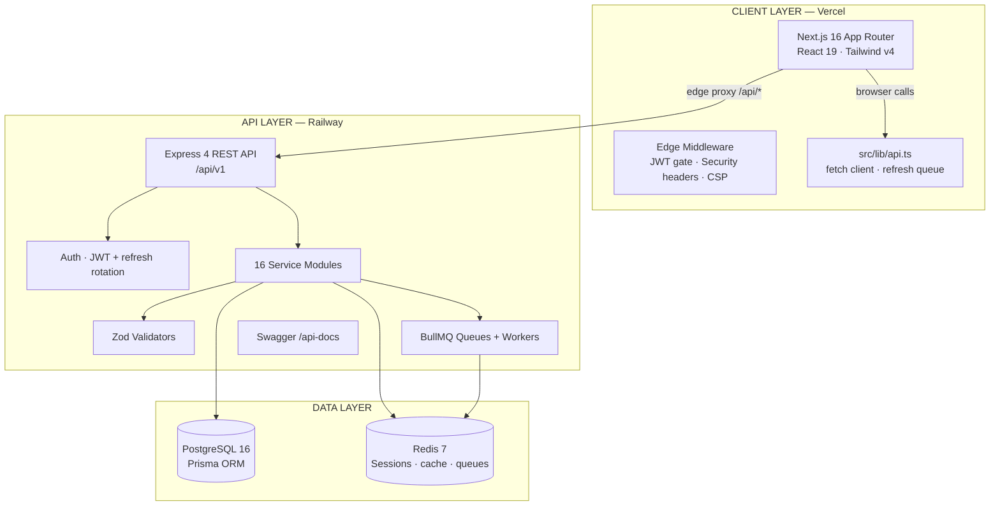

# Assetrix — Project Health Report

**Generated:** 1 August 2026 · **Scope:** full repository (`src/`, `backend/`, config, deployment) · **Method:** manual code audit, static analysis, live deployment checks, `typecheck` / `lint` / `build` execution.

> Every finding below was verified against the actual source code at the time of writing. Line numbers refer to the current `main` branch.

---

## 1. Architecture Diagram



---

## 2. Folder Tree

```
assetrix/
├── src/                                  # Next.js 16 frontend
│   ├── app/
│   │   ├── layout.tsx / page.tsx / error.tsx / not-found.tsx
│   │   ├── globals.css
│   │   ├── login/ register/ forgot-password/ reset-password/
│   │   ├── verify-email/ session-expired/
│   │   └── dashboard/                    # 11 modules
│   │       ├── page.tsx · assets/ · allocations/ · bookings/
│   │       ├── maintenance/ · audit/ · reports/ · notifications/
│   │       ├── organization/ · profile/ · settings/ · logs/
│   │       └── **/_components/           # tabs, forms, tables, data.ts, types.ts
│   ├── components/
│   │   ├── ui/                           # shadcn primitives (badge, button, sheet, table…)
│   │   ├── auth/ · profile/              # auth + profile widgets
│   │   ├── dashboard/                    # shell, navbar, sidebar, charts/
│   │   ├── landing/                      # hero, features, workflow, analytics…
│   │   └── shared/                       # ai-panel, command-palette, global-search…
│   ├── contexts/                         # auth-context, dashboard-context
│   ├── hooks/                            # use-count-up, use-in-view, use-scroll-shadow
│   └── lib/                              # api.ts (13 API modules), types.ts, utils.ts
│
├── backend/                              # Express 4 + Prisma 6 + BullMQ
│   ├── prisma/
│   │   ├── schema.prisma                 # 25 models + 17 enums
│   │   ├── migrations/0_init/migration.sql
│   │   └── seed.ts                       # 8 demo users + demo data
│   ├── src/
│   │   ├── app.ts                        # bootstrap: middleware, routes, workers
│   │   ├── config/                       # env, database, redis, logger, swagger
│   │   ├── controllers/ (16) · services/ (16) · routes/ (16)
│   │   ├── middleware/                   # auth, error, logger, rateLimiter, upload, validate
│   │   ├── validators/                   # Zod schemas (10)
│   │   ├── queues/                       # BullMQ queues + inline workers
│   │   ├── notifications/ · audit/ · utils/ · types/ · constants/
│   │   └── tests/                        # unit + integration (auth only)
│   ├── Dockerfile · docker-compose.yml · .env.example
│   └── package.json
│
├── docs/                                 # health + final reports (added)
├── .github/                              # issue + PR templates (added)
├── middleware.ts · next.config.ts · vercel.json · railway.json
├── components.json · eslint.config.mjs · postcss.config.mjs · tsconfig.json
├── package.json · package-lock.json
├── README.md · CHANGELOG.md · CONTRIBUTING.md · SECURITY.md
├── CODE_OF_CONDUCT.md · LICENSE · AGENTS.md · CLAUDE.md
```

---

## 3. Dependency Report

### Frontend (`package.json`)
| Package | Version | Used | Notes |
|:--------|:--------|:-----|:------|
| next | 16.2.10 | ✔ | App Router + Turbopack |
| react / react-dom | 19.2.4 | ✔ | |
| @base-ui/react | ^1.6.0 | ✔ | Modals, popovers |
| lucide-react | ^1.24.0 | ✔ | Icons (optimized imports) |
| recharts | ^3.9.2 | ✔ | Dashboard charts |
| next-themes | ^0.4.6 | ✔ | dark/light/system |
| class-variance-authority · clsx · tailwind-merge | ✔ | shadcn stack |
| tw-animate-css | ^1.4.0 | ✔ | animation utilities |
| tailwindcss v4 · @tailwindcss/postcss | ✔ | styling |
| typescript · eslint · eslint-config-next | ✔ | tooling |
| shadcn (CLI) | ^4.13.0 | ✔ | component scaffold |

**Unused frontend deps:** none found.

### Backend (`backend/package.json`)
| Package | Version | Used | Notes |
|:--------|:--------|:-----|:------|
| express | ^4.21.2 | ✔ | |
| @prisma/client / prisma | ^6.9.0 | ✔ | |
| bullmq · ioredis | ✔ | queues + redis |
| jsonwebtoken · bcrypt | ✔ | auth |
| helmet · compression · cookie-parser · cors · express-rate-limit | ✔ | hardening |
| multer | ✔ | uploads |
| nodemailer | ✔ | email |
| pdfkit · exceljs | ✔ | PDF/Excel export |
| pino · pino-pretty | ✔ | logging |
| swagger-jsdoc · swagger-ui-express | ✔ | docs (dev only) |
| uuid · zod · dotenv | ✔ | utilities |
| jest · ts-jest · supertest · ts-node · tsx · husky · lint-staged · prettier | ✔ | dev/test tooling |

**Unused backend deps:** none strictly orphaned. `supertest`/`@types/supertest` are used only by the single integration test; `ts-node` is used only by the `prisma:seed` script (dev runs on `tsx`).

---

## 4. Missing Dependencies / Tooling

- **Frontend test runner** — no unit/component tests and no test script. Backend has Jest; frontend has none.
- **Frontend `typecheck` script** — was absent; **added** (`tsc --noEmit`).
- **`sitemap.ts` / `robots.ts`** — missing for SEO (see §9).
- **Cron job for queue workers** — the backend runs workers in-process; there is no scheduled scheduler (e.g. maintenance-scheduler never fires).

---

## 5. Dead Code

| Location | Finding |
|:---------|:--------|
| `backend/src/queues/workers/email.worker.ts` | Entire file is **never imported** anywhere (99 lines). The live email worker is the inline one in `queues/index.ts`. |
| `backend/src/queues/index.ts:110` `setupQueues()` | Exported but **never called**; workers actually start as an import side-effect. |
| `backend/src/queues/index.ts` | `maintenanceQueue`, `cleanupQueue`, `imageQueue` declared but never `.add()`-ed. |
| `admin.service.ts` `backupDatabase` | Creates an `IN_PROGRESS` Report row but **never performs a backup**; imports `os`/`fs` for unused health/backup logic. |
| AI worker (`queues/index.ts:75`) | Returns `[]` — batch recommendation generation is a no-op. |
| Audit-export worker (`queues/index.ts:93`) | Returns `{ exportUrl: '' }` — exported audit files are never produced/retrievable. |
| `report.service.ts` | Enqueues report jobs but the service marks reports `COMPLETED` before the worker runs; the worker returns a URL only, no file work. |
| Frontend `DUMMY_NOTIFICATIONS` / `TASK_QUEUE` in `dashboard-navbar.tsx` | Static mock data rendered in production UI (real `/notifications` API exists). |
| `_components/data.ts` files (assets, allocations, bookings, maintenance, audit, notifications) | Large static datasets; several dashboard tabs render mock data instead of calling the real API. |

---

## 6. Duplicate Code

- **Error boundaries** — `src/app/error.tsx` and `src/app/dashboard/error.tsx` duplicate the same "Try Again" + dashboard-link markup.
- **Tab pattern** — each dashboard module re-implements the same tabs/table/filter layout in `_components/*-tabs.tsx` (~20–40 KB each) instead of sharing a generic table component.
- **Table columns & type definitions** — repeated per-module in `_components/types.ts` and `data.ts` rather than centralizing in `src/lib/types.ts`.
- **API modules** — 13 modules in `src/lib/api.ts` are well-factored (not duplicated).

---

## 7. Performance Issues

| Severity | Finding |
|:---------|:--------|
| Medium | Dashboard is fully client-side; every page hydrates the whole shell. Skeleton `loading.tsx` pages mitigate perceived latency. |
| Medium | `allocation-tabs.tsx` runs a `nowMs` countdown timer that re-renders the tab component every second. |
| Low | Many list endpoints lack pagination server-side (e.g. notifications), so responses can grow unboundedly. |
| Low | Frontend `exportPDF()` in `asset-directory-table.tsx` generates a **fake text file** — not a real PDF; misleading for users. |
| Low | Hard page navigations (`window.location.href`) in `api.ts:184–193` and `dashboard-context.tsx:183` skip SPA transitions. |
| Info | `next.config.ts` sets immutable cache on `/_next/static` and `no-store` on `/api` — good defaults. |

---

## 8. Security Issues

| Severity | Finding |
|:---------|:--------|
| **Critical** | `.env.vercel-prod` and `.env.vercel-prod2` were **committed to git** and contained live **Vercel OIDC tokens** (project/team/user identifiers). **Removed from tracking and `.gitignore`d** in this pass. **Action required:** revoke/rotate those OIDC credentials in Vercel, and purge them from git history if the repo is public. |
| High | `vercel.json` locks CORS to `https://assetrix.vercel.app` while the deployed app is at `assetrix-nu.vercel.app`. The backend itself allows `https://*.vercel.app` so API calls work, but the edge CORS header is misleading. |
| Medium | CSP in `middleware.ts` uses `'unsafe-inline'` and `'unsafe-eval'` for scripts — weakens XSS protection. Tightening may break the app (see note in README). |
| Medium | Edge JWT check (`middleware.ts`) validates only the **format** (3 dot-separated parts), not the signature — protects UI navigation, not data access. Acceptable for a UX gate; real auth happens at the API. |
| Medium | Session token cookie is `SameSite=None; Secure` but **not `HttpOnly`** (JS-readable by design for the refresh flow). |
| Medium | Auth rate limiter uses **in-memory store** (process-local; resets on restart, not shared across instances). |
| Low | `config/index.ts:40–41` throws on missing `JWT_SECRET`/`JWT_REFRESH_SECRET` even in development (the dev fallback branch is unreachable). |
| Low | Seed data hashes passwords with `SALT_ROUNDS=10` while the runtime uses 12 — demo users only, but inconsistent. |
| Low | `upload` middleware validates MIME types but not magic bytes; `multer` limits file size. |
| Info | `alert()` used for error surfacing in `maintenance-tabs.tsx`, `reports/page.tsx`, `report-tabs.tsx` — poor UX/a11y, and `alert()` in `report-tabs.tsx:581` on error. |

---

## 9. Accessibility Issues

| Finding |
|:--------|
| Good baseline: `main id="main-content" role="main"`, focus-visible rings, labelled inputs, base-ui modal focus management, `prefers-reduced-motion` support. |
| `alert()` error dialogs are non-descriptive and break the interaction flow (see §8). |
| AI panel and keyboard-shortcuts panel render as full-screen overlays (`z-[100]`) without `aria-modal` or an explicit focus trap. |
| Some icon-only buttons rely on `title` attribute; should use `aria-label` consistently (most already do). |

---

## 10. SEO Report

| Item | Status |
|:-----|:-------|
| `title` / `description` / keywords | ✔ set in `layout.tsx` |
| OpenGraph + Twitter cards | ✔ set |
| `metadataBase` | ✔ set |
| OG image (`/opengraph-image`) | ✘ missing |
| `sitemap.xml` | ✘ missing |
| `robots.txt` | ✘ missing |
| Heading hierarchy | ✔ landing uses h1 → h2 → h3 |
| Alt text on marketing images | Mostly decorative SVGs (aria-hidden) — acceptable |

---

## 11. Responsive Design Report

| Breakpoint | Status |
|:-----------|:-------|
| Mobile (< 640px) | ✔ stacked layouts, `MobileNav`, full-width cards, 44px touch targets |
| Tablet (640–1024) | ✔ two-column grids, collapsible sidebar |
| Laptop (1024–1280) | ✔ full sidebar, inline filters |
| Desktop (1280+) | ✔ full dashboard experience |
| Risk | Long unbroken data tables and some fixed-width modals may overflow on narrow screens; not tested at 320px. |

---

## 12. Code Quality Score — **7.2 / 10**

**Strengths:** strict TypeScript, clean layering (controller/service/validator), well-indexed schema, security headers, single-flight token refresh, typed API client, memoized contexts.
**Weaknesses:** mock data in production UI paths, dead workers/queues, duplicate tab implementations, mixed service patterns (class vs object), `as any` in several controllers, no frontend tests, no lint on CI.

---

## 13. Documentation Score — **8.0 / 10** (after this pass)

README rebuilt, CHANGELOG/CONTRIBUTING/SECURITY/CODE_OF_CONDUCT/LICENSE added, Swagger present. Gaps: no `docs/ARCHITECTURE.md` beyond README, no inline API examples in Swagger for every route.

---

## 14. Production Readiness Score — **6.5 / 10**

**Blocking for production:**
1. Backend deployment is **down** (domain does not resolve) — see §16.
2. Committed secrets must be rotated and purged from history.
3. Mock data leaks into production UI (notifications, tasks, several tabs).
4. Report/AI/audit queue workers are stubs — exports and batch AI don't actually work end-to-end.

---

## 15. Suggestions (priority order)

1. **Rotate/revoke** the exposed Vercel OIDC tokens and purge git history.
2. **Restore the backend deployment** (Railway) and re-verify `/health` + `/api-docs`; update `NEXT_PUBLIC_API_URL` accordingly.
3. **Wire the queue workers properly** (or remove dead queues): report generation, AI batch, audit export, maintenance scheduler.
4. **Replace mock data** in dashboard components with real API calls (notifications, tasks, tabs).
5. Add `robots.txt`, `sitemap.ts`, and an OG image.
6. Add frontend tests (Vitest or Jest) and CI (GitHub Actions) that run lint + typecheck + tests + build.
7. Replace `alert()` with inline error components.
8. Add `HttpOnly` refresh-token cookie for the refresh endpoint (keep the access token JS-readable).
9. Paginate backend list endpoints.
10. Reconcile `vercel.json` CORS origins with the canonical domain.

---

## 16. Deployment Verification (live, 1 Aug 2026)

| Service | URL | Result |
|:--------|:----|:-------|
| Frontend | `https://assetrix-nu.vercel.app` | ✔ **200 OK**, renders landing, `/login` renders (client bails to CSR correctly) |
| Frontend canonical | `https://assetrix.vercel.app` | ⚠ 307 redirect loop / no `Location` — points at an alias that does not settle |
| Backend API | `assetrix-backend-production-9a94.up.railway.app` | ✘ **DNS does not resolve** — backend is unreachable |
| API Docs | `/api-docs` via frontend proxy | ✘ 404 (backend host unreachable) |
| `npm run build` (frontend) | local | ✔ 20 routes, `Proxy (Middleware)` emitted |
| `npm run lint` + `npm run typecheck` | local | ✔ 0 errors |

**Conclusion:** the frontend is deployed and builds cleanly, but the **backend API is offline**, so the platform is not fully operational. The README previously claimed both services "✅ Active" — that claim is corrected in the rebuilt README.
